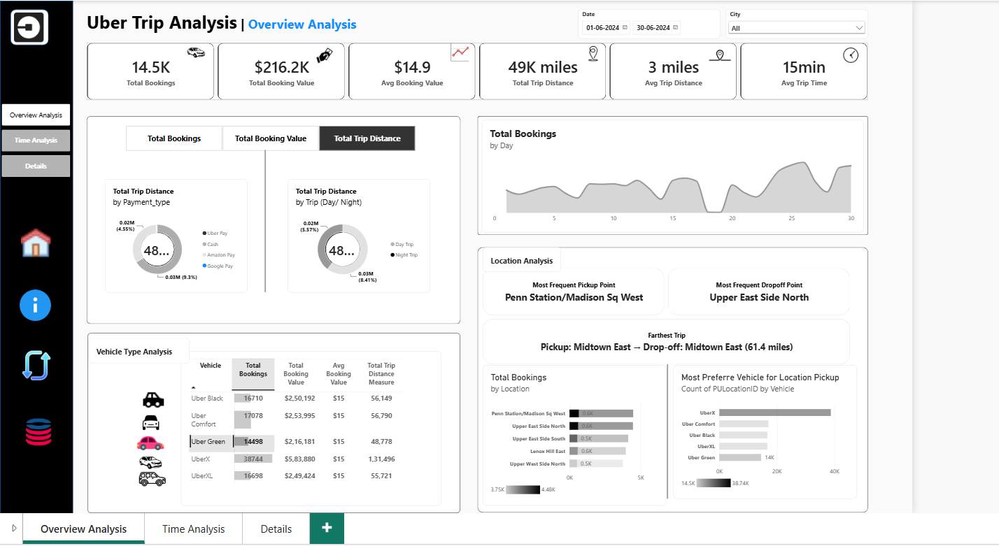

# 🚕 Uber Trip Analysis Dashboard | Power BI

## 📊 Project Overview

This project is an interactive Uber Trip Analysis Dashboard developed using Microsoft Power BI.

The dashboard analyzes Uber trip data to understand booking performance, revenue, trip distance, trip duration, vehicle types, and pickup/drop-off locations.

The main objective is to transform raw trip data into meaningful business insights through interactive visualizations and KPIs.

---

## 🛠️ Tools & Technologies

- Microsoft Power BI
- Power Query
- DAX
- Data Cleaning & Transformation
- Data Visualization
- Excel / CSV

---

## 📌 Key KPIs

The dashboard provides important performance indicators such as:

- Total Bookings
- Total Booking Value
- Average Booking Value
- Total Trip Distance
- Average Trip Distance
- Average Trip Time
- Vehicle Type Performance
- Pickup & Drop-off Analysis

---

## 📈 Dashboard Features

### 🔹 Overview Analysis

- Total booking analysis
- Revenue analysis
- Average booking value
- Trip distance analysis
- Trip time analysis
- Vehicle type comparison
- Location analysis

### 🔹 Time Analysis

- Daily booking trends
- Booking patterns over time
- Peak booking periods
- Trip distance trends

### 🔹 Location Analysis

- Most frequent pickup locations
- Most frequent drop-off locations
- Pickup and drop-off performance
- Vehicle preference by location

---

## 🔍 Key Insights

- Identified the most frequently used pickup and drop-off locations.
- Analyzed booking performance across different vehicle types.
- Compared total booking value and booking volume.
- Analyzed trip distance and average trip duration.
- Identified booking trends across different dates.
- Compared vehicle preferences across locations.

---

## 📷 Dashboard Preview

---

## 🎯 Project Objective

The objective of this project is to demonstrate practical data analytics skills by converting raw Uber trip data into an interactive business intelligence dashboard.

The project focuses on:

- Data preparation
- Data analysis
- KPI development
- DAX calculations
- Interactive dashboard design
- Business insight generation

---

## 👨‍💻 Author

**Mohammad Shadab**

BCA | Artificial Intelligence & Data Analytics

GitHub: [ShadabByte](https://github.com/ShadabByte)
